<div align="center">

# InferenceGateway

### A production-shaped GPU data plane for low-latency LLM inference

Ray Serve ingress in front of vLLM's `AsyncLLMEngine`, with continuous
batching, prefix caching, backpressure, reproducible load tests, and live GPU
telemetry.

[](https://github.com/xiyiji/InferenceGateway/actions/workflows/ci.yml)


`continuous batching` · `PagedAttention` · `prefix caching` · `SSE streaming`
· `TTFT / TPOT / goodput` · `DCGM telemetry`

</div>

This repository is the GPU engine layer of a two-repository serving stack.
[llm-serving-platform](https://github.com/xiyiji/llm-serving-platform) is the
companion gateway and operations layer for cross-engine routing, request
micro-batching, response caching, release controls, and the web console.

## Architecture

```mermaid
flowchart LR
    CLIENT[OpenAI SDK / benchmark client]

    subgraph CONTROL[llm-serving-platform · optional control plane]
        ROUTER[Adaptive router]
        MBATCH[Gateway micro-batcher]
        RCACHE[Prefix response cache]
        ROUTER --> MBATCH --> RCACHE
    end

    subgraph ENGINE[InferenceGateway · GPU data plane]
        API[Ray Serve + FastAPI ingress]
        LIMIT[Queue policy + backpressure]
        VLLM[vLLM AsyncLLMEngine]
        SCHED[Continuous batching + PagedAttention]
        GPU[CUDA GPU]
        API --> LIMIT --> VLLM --> SCHED --> GPU
    end

    CLIENT --> ROUTER
    CLIENT -. direct benchmark .-> API
    RCACHE -->|OpenAI-compatible HTTP + SSE| API
    GPU -. vLLM metrics .-> PROM[Prometheus]
    GPU -. DCGM exporter .-> PROM
    PROM --> GRAFANA[Grafana]
```



The two batching layers are intentionally separate. The companion gateway
groups near-simultaneous HTTP requests before dispatch; vLLM continuously
schedules active sequences and GPU KV blocks while tokens are generated.

## Technology stack

| Layer | Technology | Responsibility |
|---|---|---|
| Serving ingress | Ray Serve, FastAPI, Pydantic | OpenAI-compatible `/v1/chat/completions`, SSE streaming |
| Inference engine | vLLM `AsyncLLMEngine`, PyTorch, CUDA | Asynchronous generation and GPU execution |
| Latency path | Continuous batching, PagedAttention, prefix caching | Higher GPU occupancy and KV-block reuse |
| Flow control | Ray `max_ongoing_requests`, request timeouts | Bounded queues and overload behavior |
| Baseline | Hugging Face Transformers `generate()` | Single-request control for batching comparisons |
| GPU telemetry | NVIDIA DCGM Exporter, vLLM metrics | GPU utilization, queue state, and KV-cache occupancy |
| Observability | Prometheus, Grafana | Metrics collection and serving dashboards |
| Benchmarking | asyncio, httpx, NumPy, pandas, Matplotlib | Concurrency sweeps, TTFT, E2E latency, throughput, goodput |
| Verification | pytest, GitHub Actions | CPU-only API-contract and statistics tests |

## Capability matrix

| Capability | Status | Scope |
|---|---|---|
| OpenAI-compatible chat completions + SSE | Implemented | Ray Serve ingress |
| vLLM continuous batching + PagedAttention | Implemented | Engine runtime |
| Prefix KV-cache support | Implemented | `enable_prefix_caching=True` in vLLM |
| Ray Serve autoscaling and backpressure | Implemented | 1–2 replicas, bounded ongoing requests |
| HF Transformers baseline | Implemented | Separate single-request service |
| TTFT, E2E, throughput, goodput harness | Implemented | Fixed-seed async benchmark client |
| Prometheus + DCGM scrape configuration | Configured | Requires a running NVIDIA GPU environment |
| Published GPU result tables and curves | Pending fresh run | Generated under `results/`, not claimed from source alone |
| Adaptive routing and gateway micro-batching | Companion integration | Implemented in `xiyiji/llm-serving-platform` |

## Serving API

```python
from openai import OpenAI

client = OpenAI(base_url="http://localhost:8000/v1", api_key="unused")
reply = client.chat.completions.create(
    model="Qwen/Qwen2.5-7B-Instruct",
    messages=[{"role": "user", "content": "Explain continuous batching."}],
)
```

The default deployment serves `Qwen/Qwen2.5-7B-Instruct` in BF16, allows up
to 128 active sequences, reserves 90% of GPU memory for the engine, and enables
vLLM prefix caching. These values are deployment arguments rather than fixed
hardware claims.

## Metrics

- **TTFT**: time to first token, including prefill and queue wait
- **E2E latency**: p50, p95, and p99 from request start to final token
- **Throughput**: output tokens per second across concurrent requests
- **Goodput**: requests per second meeting the configured latency objective
- **GPU utilization**: sampled from NVIDIA DCGM metrics
- **KV-cache occupancy**: sampled from vLLM cache gauges

## Benchmark workflow

The checked-in harness compares the Hugging Face baseline with vLLM at
increasing concurrency:

```bash
make test

# GPU environment
serve run serve.app:deployment --model Qwen/Qwen2.5-7B-Instruct
python serve/baseline_hf.py --model Qwen/Qwen2.5-7B-Instruct
make bench
```

`make bench` writes machine-readable results under `results/` and generates a
throughput-versus-p95 curve. A credible result should record the GPU, model,
commit SHA, vLLM version, concurrency, and generation length. Source code and
CPU tests alone are not presented as GPU benchmark evidence.

The broader experiment plan in [SPEC.md](SPEC.md) covers concurrency,
`max_num_seqs`, GPU-memory utilization, BF16/FP8/AWQ, quality checks, and burst
load. Those comparisons remain experiments until a fresh GPU run produces the
corresponding artifacts.

## Run the stack

```bash
pip install -r requirements.txt
serve run serve.app:deployment --model Qwen/Qwen2.5-7B-Instruct

# optional monitoring
docker compose -f monitoring/docker-compose.yml up
```

Point `llm-serving-platform` at this engine:

```bash
LSP_UPSTREAM_BASE_URL=http://<inference-gateway-host>:8000/v1
LSP_UPSTREAM_MODELS=Qwen/Qwen2.5-7B-Instruct
```

See [SPEC.md](SPEC.md) for the acceptance criteria and experiment design.
